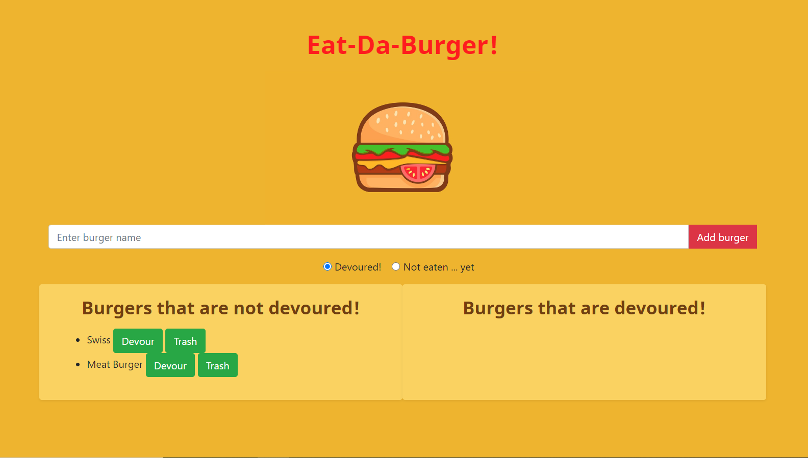

# Burger Logger

## Overview 

Eat-Da-Burger! is a restaurant app that lets users input the names of burgers they'd wish to eat. You have the option to save a burger later or devour it. The devoured or saved burger will appear below, where they can be trashed.

## Technology Used

- MySQL 
- Node 
- Express 
- Handlebars 
- Homemade ORM 

## Future Improvements

- Allow users to eat other foods
- View trashed burgers/food

## View Site

